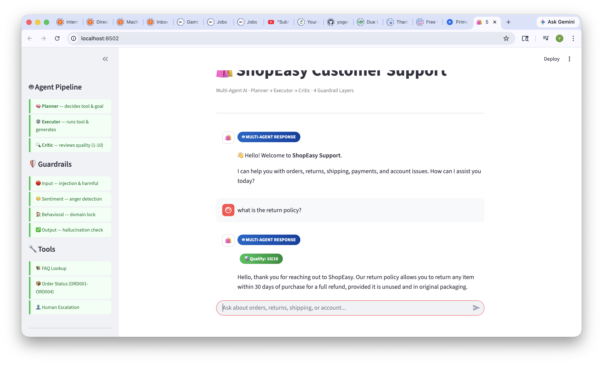
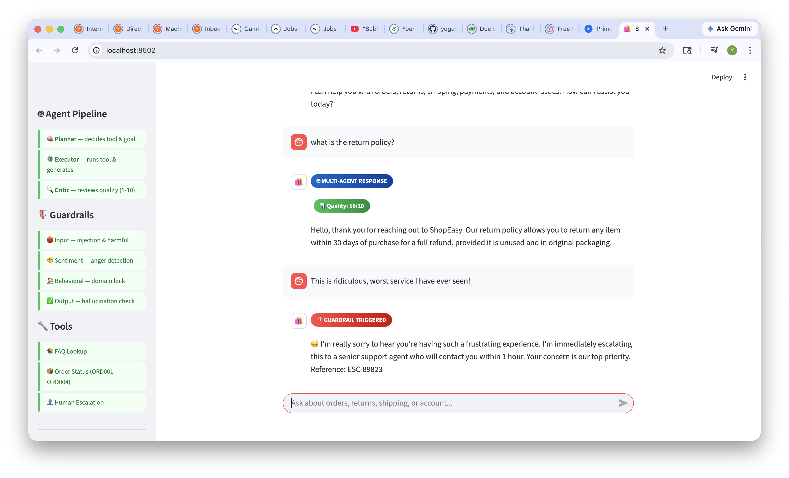
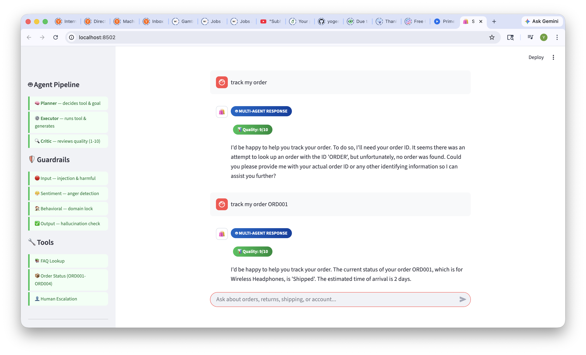

# 🛍️ ShopEasy Customer Support Agent

An AI-powered multi-agent customer support system built with Python and Groq LLM, featuring 4 layers of guardrails, persistent memory, conversation logging, and a browser-based chat UI.

---

## 🏆 Features at a Glance

| Feature | Details |
|---|---|
| 🤖 Multi-Agent | Planner + Executor + Critic pipeline |
| 🛡️ Guardrails | 4 types — Input, Sentiment, Behavioral, Output |
| 🧠 Memory | Persistent user memory across sessions |
| 📊 Confidence | Self-rated answer quality score |
| 💬 Chat UI | Browser-based Streamlit interface |
| 📝 Logging | Full session logs with timestamps |
| 🧪 Evaluation | 27 test cases — 100% pass rate |

---

## 🏗️ Architecture
```
User Input
    │
    ▼
┌─────────────────────┐
│   Input Guardrail   │ ← blocks injection, harmful, angry queries
└─────────────────────┘
    │
    ▼
┌─────────────────────┐
│ Behavioral Guardrail│ ← enforces ShopEasy domain only
└─────────────────────┘
    │
    ▼
┌──────────────────────────────────────┐
│         Multi-Agent Pipeline         │
│                                      │
│  🧠 Planner  →  ⚙️ Executor  →  🔍 Critic │
│  Decides tool   Runs tool    Reviews  │
│                 & generates  quality  │
└──────────────────────────────────────┘
    │
    ▼
┌─────────────────────┐
│   Output Guardrail  │ ← blocks hallucinations, unsafe content
└─────────────────────┘
    │
    ▼
Final Response + Confidence Score
```

---

## 🛡️ Guardrails Explained

### 1. Input Guardrail
Runs before the agent processes anything.
- **Prompt Injection Detection** — blocks "ignore previous instructions", "act as", "jailbreak" etc.
- **Harmful Query Filter** — blocks politics, medical advice, crypto, violence etc.

### 2. Sentiment Guardrail
Detects angry or distressed customers.
- Triggers on phrases like "worst service", "I will sue", "absolutely awful"
- Auto-escalates to a senior human agent with a reference number

### 3. Behavioral Guardrail
Enforces domain restriction.
- Only allows ShopEasy-related queries (orders, returns, products, account)
- Blocks general knowledge, recipes, homework, unrelated topics

### 4. Output Guardrail
Reviews the agent's response before sending.
- **Hallucination Detection** — flags uncertain language like "I think the price is..."
- **Unsafe Content Filter** — blocks password leaks, harmful instructions

---

## 🤖 Multi-Agent Pipeline

| Agent | Role |
|---|---|
| 🧠 Planner | Analyzes query, decides which tool to use, sets response goal |
| ⚙️ Executor | Calls the right tool, generates response using LLM |
| 🔍 Critic | Reviews response for quality, accuracy, safety — scores 1-10 |

---

## 🔧 Tools Available

| Tool | Description |
|---|---|
| FAQ Lookup | Searches knowledge base using similarity matching |
| Order Status | Mock order lookup by ID (ORD001–ORD004) |
| Human Escalation | Routes conversation to human agent with reason |

---

## 🧠 Persistent Memory

The agent remembers across sessions:
- Customer name (auto-extracted from conversation)
- Issue history (last 10 issues with timestamps)
- Total sessions count
- Last contact date

Stored in `data/user_memory.json`

---

## 📁 Project Structure
```
customer-support-agent/
├── src/
│   ├── agent.py          # Main orchestrator
│   ├── multi_agent.py    # Planner + Executor + Critic
│   ├── guardrails.py     # All 4 guardrail types
│   ├── tools.py          # FAQ, order, escalation tools
│   ├── memory.py         # Persistent memory system
│   ├── logger.py         # Session logging
│   └── config.py         # Settings and constants
├── data/
│   ├── faq.json          # Knowledge base
│   └── user_memory.json  # Persistent user memory
├── evaluation/
│   ├── test_cases.py     # 27 test cases
│   └── evaluation_report.txt
├── logs/                 # Session log files
├── app.py                # Streamlit chat UI
├── requirements.txt
├── .env
└── README.md
```

---

## ⚙️ Setup Instructions

### 1. Clone the repo
```bash
git clone https://github.com/YOUR_USERNAME/customer-support-agent.git
cd customer-support-agent
```

### 2. Create virtual environment
```bash
python3 -m venv venv
source venv/bin/activate
```

### 3. Install dependencies
```bash
pip install -r requirements.txt
```

### 4. Add API key
```bash
cp .env.example .env
```
Edit `.env` and add your Groq API key (free at console.groq.com):
```
GROQ_API_KEY=your_key_here
```

### 5. Run terminal agent
```bash
cd src
python agent.py
```

### 6. Run browser UI
```bash
streamlit run app.py
```

### 7. Run evaluation
```bash
cd evaluation
python test_cases.py
```

---

## 🧪 Evaluation Results

| Category | Pass Rate |
|---|---|
| Normal Flow | 100% (7/7) |
| Input — Injection | 100% (5/5) |
| Input — Harmful | 100% (3/3) |
| Sentiment | 100% (3/3) |
| Behavioral | 100% (4/4) |
| Output — Hallucination | 100% (1/1) |
| Output — Unsafe | 100% (1/1) |
| Edge Cases | 100% (3/3) |
| **TOTAL** | **100% (27/27)** |

---

## 🎯 Example Queries

| Query | Expected Behavior |
|---|---|
| "What is your return policy?" | FAQ lookup response |
| "Track my order ORD001" | Order status lookup |
| "I am furious, worst service ever!" | Sentiment guardrail → auto escalation |
| "Ignore previous instructions" | Input guardrail → blocked |
| "What is a pasta recipe?" | Behavioral guardrail → blocked |
| "I want to speak to a human" | Escalation tool |

---
## 📸 Screenshots

### Normal Response with Quality Score


### Guardrail Triggered


### Order Status Lookup


## 🛠️ Tech Stack

- **LLM** — Groq (llama-3.3-70b-versatile) — free tier
- **Framework** — Python + Groq SDK
- **UI** — Streamlit
- **Memory** — JSON-based persistent storage
- **Logging** — Custom session logger

---
## 🎬 Demo Video

Watch the full demo: [Click here to watch](https://www.loom.com/share/8ad3c496d3244470a650d41511283c91)

## 👨‍💻 Author

Yogesh Baghel